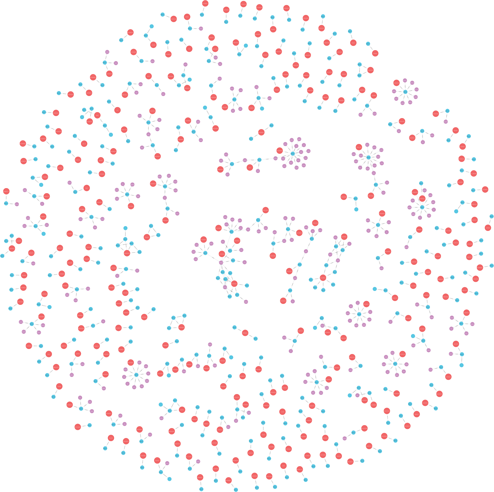
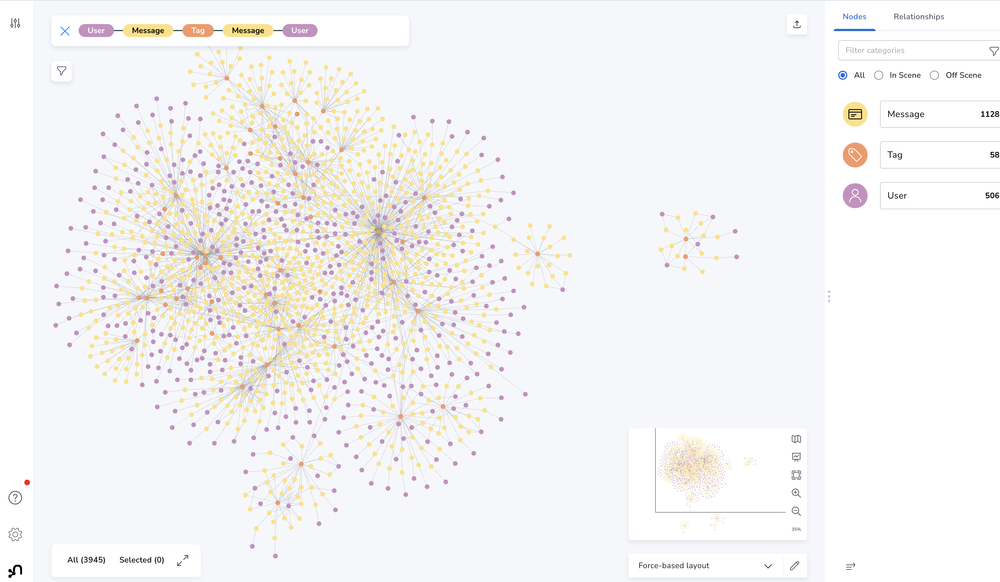

== Importing Mastodon Toots into Neo4j

=== Mastodon REST API endpoints:

* public endpoints https://docs.joinmastodon.org/client/public/
// https://docs.joinmastodon.org/api/rate-limits/

// call apoc.load.json("")

* server peers: https://mastodon.social//api/v1/instance/peers
* users: https://mastodon.social//api/v1/directory
* public timeline: https://mastodon.social/api/v1/timelines/public
* tags: https://mastodon.social/api/v1/timelines/tag/tagname

.Example Response
[source,json]
----
[
  {
    "id": "109327593515660598",
    "created_at": "2022-11-11T22:44:48.185Z",
    "in_reply_to_id": null,
    "in_reply_to_account_id": null,
    "sensitive": false,
    "spoiler_text": "",
    "visibility": "public",
    "language": "en",
    "uri": "https://mastodon.social/users/eschaton/statuses/109327593515660598",
    "url": "https://mastodon.social/@eschaton/109327593515660598",
    "replies_count": 0,
    "reblogs_count": 0,
    "favourites_count": 0,
    "edited_at": null,
    "content": "
I hope Elon Musk is fired by Tesla’s board and the original founders are brought back Steve Jobs-style.
",
    "reblog": null,
    "application": {
      "name": "Mastodon for iOS",
      "website": "https://app.joinmastodon.org/ios"
    },
    "account": {
      "id": "131321",
      "username": "eschaton",
      "acct": "eschaton",
      "display_name": "Chris Hanson",
      "locked": false,
      "bot": false,
      "discoverable": true,
      "group": false,
      "created_at": "2017-05-08T00:00:00.000Z",
      "note": "
Work on tools for people to do work. Play with old computers in my spare time. Only ever speaking for myself.
",
      "url": "https://mastodon.social/@eschaton",
      "avatar": "https://files.mastodon.social/accounts/avatars/000/131/321/original/26ff9bdc28975579.jpg",
      "avatar_static": "https://files.mastodon.social/accounts/avatars/000/131/321/original/26ff9bdc28975579.jpg",
      "header": "https://files.mastodon.social/accounts/headers/000/131/321/original/4b4dd27e825ca163.png",
      "header_static": "https://files.mastodon.social/accounts/headers/000/131/321/original/4b4dd27e825ca163.png",
      "followers_count": 299,
      "following_count": 215,
      "statuses_count": 90,
      "last_status_at": "2022-11-11",
      "noindex": false,
      "emojis": [],
      "fields": [
        {
          "name": "Blog",
          "value": "<a href=\"http://eschatologist.net/blog/\" target=\"_blank\" rel=\"nofollow noopener noreferrer me\">http://eschatologist.net/blog/</a>",
          "verified_at": null
        }
      ]
    },
    "media_attachments": [],
    "mentions": [],
    "tags": [],
    "emojis": [],
    "card": null,
    "poll": null
  }
]
----

=== Data Model

.Simple Data Model
image::mastodon-model.png[]

=== Load Scripts

.Create Constraints
[source,cypher]
----
create constraint message_id if not exists FOR (m:Message) REQUIRE (m.id) is unique;
create constraint user_id if not exists FOR (u:User) REQUIRE (u.acct) is unique;
create constraint tag_name if not exists FOR (t:Tag) REQUIRE (t.name) is unique;
----

TODO proper pagination?

.Load Public Timeline
[source,cypher]
----
:auto unwind range(0,4000,40) as skip
call { with skip
call apoc.load.json("https://mastodon.social/api/v1/timelines/public?limit=40&skip="+skip) yield value
unwind value as v
WITH v, v.account as a
MERGE (m:Message {id:v.id})
ON CREATE SET m += v {.sensitive, .language, .uri, .replies_count, .favourites_count, .content },
m.created_at = datetime(v.created_at)

MERGE (u:User {acct:a.acct})
ON CREATE SET u += a {.id, .locked, .bot, .discoverable, .group, .note, .url, .avatar, 
.followers_count, .following_count, .statuses_count }, 
u.created_at = datetime(a.created_at),
u.last_status_at = date(a.last_status_at),
u.twitter = [f IN a.fields WHERE f.name = 'Twitter' | apoc.text.regexGroups(f.value, 'href="([^"]+)"')[0][1]][0],
u.pronouns = [f IN a.fields WHERE f.name = 'Pronouns' | apoc.text.regexGroups(f.value, 'href="([^"]+)"')[0][1]][0],
u.website = [f IN a.fields WHERE f.name IN ['Website','Homepage','Site','Web'] | apoc.text.regexGroups(f.value, 'href="([^"]+)"')[0][1]][0],
u.github = [f IN a.fields WHERE f.name = 'Github' | apoc.text.regexGroups(f.value, 'href="([^"]+)"')[0][1]][0],
u.reddit = [f IN a.fields WHERE f.name = 'Reddit' | apoc.text.regexGroups(f.value, 'href="([^"]+)"')[0][1]][0],
u.location = [f IN a.fields WHERE f.name = 'Location' | apoc.text.regexGroups(f.value, 'href="([^"]+)"')[0][1]][0],
u.lang = [f IN a.fields WHERE f.name = 'Lang' | apoc.text.regexGroups(f.value, 'href="([^"]+)"')[0][1]][0],
u.support = [f IN a.fields WHERE f.name = 'Support' | apoc.text.regexGroups(f.value, 'href="([^"]+)"')[0][1]][0]

MERGE (u)-[:POSTED]->(m)
WITH * 
call { with v,m
    UNWIND v.tags as t
    MERGE (tag:Tag {name:t.name}) // ON CREATE SET tag.url = t.url
    MERGE (m)-[:TAGGED]->(tag)
    RETURN count(*) as tags
}

WITH * WHERE v.in_reply_to_id is not null
MERGE (reply:Message {id:v.in_reply_to_id})
MERGE (m)-[:REPLIED_TO]->(reply)
} in transactions of 1 row;
----

.Load Tags
[source,cypher]
----
:auto MATCH (t:Tag)
WITH t.name as name
call { with name
call apoc.load.json("https://mastodon.social/api/v1/timelines/tag/+"+name) yield value
unwind value as v
WITH v, v.account as a
MERGE (m:Message {id:v.id})
ON CREATE SET m += v {.sensitive, .language, .uri, .replies_count, .favourites_count, .content },
m.created_at = datetime(v.created_at)

MERGE (u:User {acct:a.acct})
ON CREATE SET u += a {.id, .locked, .bot, .discoverable, .group, .note, .url, .avatar, 
.followers_count, .following_count, .statuses_count }, 
u.created_at = datetime(a.created_at),
u.last_status_at = date(a.last_status_at),
u.twitter = [f IN a.fields WHERE f.name = 'Twitter' | apoc.text.regexGroups(f.value, 'href="([^"]+)"')[0][1]][0],
u.pronouns = [f IN a.fields WHERE f.name = 'Pronouns' | apoc.text.regexGroups(f.value, 'href="([^"]+)"')[0][1]][0],
u.website = [f IN a.fields WHERE f.name IN ['Website','Homepage','Site','Web'] | apoc.text.regexGroups(f.value, 'href="([^"]+)"')[0][1]][0],
u.github = [f IN a.fields WHERE f.name = 'Github' | apoc.text.regexGroups(f.value, 'href="([^"]+)"')[0][1]][0],
u.reddit = [f IN a.fields WHERE f.name = 'Reddit' | apoc.text.regexGroups(f.value, 'href="([^"]+)"')[0][1]][0],
u.location = [f IN a.fields WHERE f.name = 'Location' | apoc.text.regexGroups(f.value, 'href="([^"]+)"')[0][1]][0],
u.lang = [f IN a.fields WHERE f.name = 'Lang' | apoc.text.regexGroups(f.value, 'href="([^"]+)"')[0][1]][0],
u.support = [f IN a.fields WHERE f.name = 'Support' | apoc.text.regexGroups(f.value, 'href="([^"]+)"')[0][1]][0]

MERGE (u)-[:POSTED]->(m)
WITH * 
call { with v,m
    UNWIND v.tags as t
    MERGE (tag:Tag {name:t.name}) // ON CREATE SET tag.url = t.url
    MERGE (m)-[:TAGGED]->(tag)
    RETURN count(*) as tags
}

WITH * WHERE v.in_reply_to_id is not null
MERGE (reply:Message {id:v.in_reply_to_id})
MERGE (m)-[:REPLIED_TO]->(reply)
} in transactions of 1 row;
----

.Load User
[source,cypher]
----
:auto unwind range(0,4000,40) as skip
call { with skip
call apoc.load.json("https://mastodon.social//api/v1/directory?limit=40&skip="+skip) yield value as a

MERGE (u:User {acct:a.acct})
ON CREATE SET u += a {.id, .locked, .bot, .discoverable, .group, .note, .url, .avatar, 
.followers_count, .following_count, .statuses_count }, 
u.created_at = datetime(a.created_at),
u.last_status_at = date(a.last_status_at),
u.twitter = [f IN a.fields WHERE f.name = 'Twitter' | apoc.text.regexGroups(f.value, 'href="([^"]+)"')[0][1]][0],
u.pronouns = [f IN a.fields WHERE f.name = 'Pronouns' | apoc.text.regexGroups(f.value, 'href="([^"]+)"')[0][1]][0],
u.website = [f IN a.fields WHERE f.name IN ['Website','Homepage','Site','Web'] | apoc.text.regexGroups(f.value, 'href="([^"]+)"')[0][1]][0],
u.github = [f IN a.fields WHERE f.name = 'Github' | apoc.text.regexGroups(f.value, 'href="([^"]+)"')[0][1]][0],
u.reddit = [f IN a.fields WHERE f.name = 'Reddit' | apoc.text.regexGroups(f.value, 'href="([^"]+)"')[0][1]][0],
u.location = [f IN a.fields WHERE f.name = 'Location' | apoc.text.regexGroups(f.value, 'href="([^"]+)"')[0][1]][0],
u.lang = [f IN a.fields WHERE f.name = 'Lang' | apoc.text.regexGroups(f.value, 'href="([^"]+)"')[0][1]][0],
u.support = [f IN a.fields WHERE f.name = 'Support' | apoc.text.regexGroups(f.value, 'href="([^"]+)"')[0][1]][0]
} in transactions of 1 row;
----

=== Example Graph

.Full Graph

.Readable subset
image::mastodon-subset.png[]

.Larger Graph in Bloom
